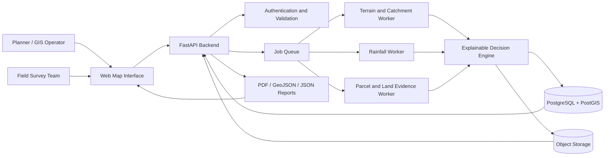
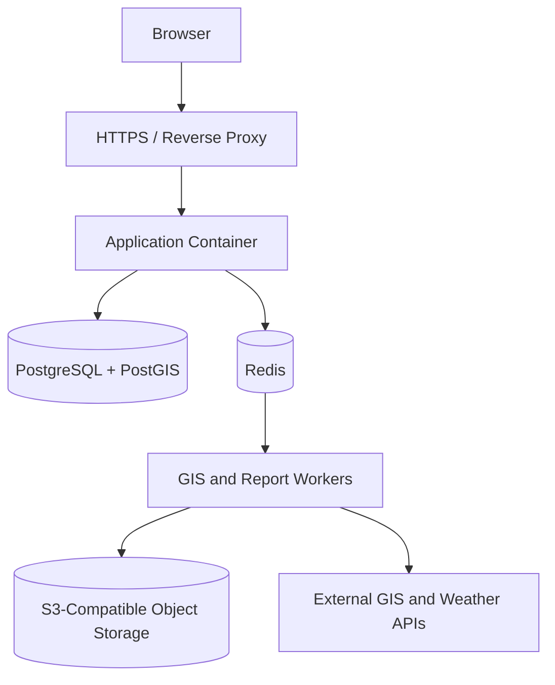
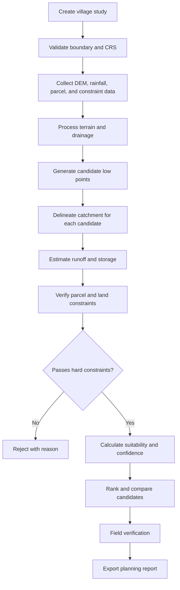

# Pond Planner Pro

# High-Level Design

## AI-Based Village Pond Planning System

## 1. Problem Statement and Objectives

### Problem statement

Selecting a village pond location manually is time-consuming and often depends on disconnected sources of information. A low-lying area may not be suitable if its catchment is too small, the land parcel is unavailable, the slope is unsafe, or the location is too close to houses, roads, utilities, or protected land.

The proposed system combines spatial datasets and domain rules into one repeatable workflow. It generates a ranked list of candidate sites and explains why each candidate is recommended, conditional, or rejected.

### Objectives

- Identify multiple possible pond locations for a selected village.

- Analyse elevation, slope, drainage, flow accumulation, and catchment area.

- Estimate rainfall-driven runoff and preliminary storage capacity.

- Verify land parcels using official records and map imagery.

- Apply configurable safety and accessibility constraints.

- Rank candidates using an explainable suitability score.

- Show data sources, timestamps, assumptions, confidence, and limitations.

- Export a field-verification report with coordinates and evidence.

### Scope boundaries

The system will provide planning support and preliminary estimates. It will not perform final structural design, legally establish ownership, replace a cadastral survey, certify soil strength, or issue construction approval.

---


## 2. Overall System Architecture


The architecture separates the user interface, API layer, geospatial processing, decision engine, and storage. Expensive raster and report operations run as background jobs so the web interface remains responsive.





### Main architectural components


| Component | Responsibility |

|---|---|

| Web interface | Map interaction, layer control, forms, candidate comparison, report access |

| API backend | Authentication, validation, orchestration, job status, and API contracts |

| Terrain worker | DEM preparation, slope, contours, flow direction, accumulation, and catchments |

| Rainfall worker | Provider integration, rainfall summaries, runoff estimates, and caching |

| Land worker | Parcel lookup, WMS imagery, mask extraction, and area comparison |

| Decision engine | Hard constraints, weighted score, confidence, and explanation generation |

| PostgreSQL/PostGIS | Users, studies, geometries, scores, metadata, and spatial queries |

| Object storage | DEMs, raster outputs, downloaded imagery, photographs, and reports |

| Job queue | Reliable execution of long-running and retryable tasks |


### Deployment view





---


## 3. Functional Requirements and Project Workflow


### Functional requirements


1. Users can search for a village or enter a study boundary.

2. Users can view satellite, elevation, slope, contour, drainage, and parcel layers.

3. The system can generate or accept candidate pond points.

4. The system can delineate an upstream catchment for a candidate.

5. Rainfall data can be fetched, cached, and displayed with its source and period.

6. Parcel area can be compared with official land-record information.

7. Candidates can be filtered using configurable hard constraints.

8. Candidates receive a suitability score and confidence level.

9. Each score includes a human-readable explanation.

10. Field reviewers can record observations, photographs, and approval status.

11. Users can export results as PDF, JSON, and GeoJSON.


### End-to-end workflow





### Workflow stages


**Study creation:** The user selects a village, boundary, buffer, coordinate system, and analysis configuration.


**Evidence collection:** The system records the source, retrieval time, resolution, units, and version of every external dataset.


**Spatial analysis:** DEM data is clipped to the study area, checked for missing values, and processed into terrain and drainage layers.


**Candidate analysis:** Potential low points are filtered, their catchments are delineated, and rainfall-runoff estimates are generated.


**Decision and review:** Hard constraints remove unsafe sites. The remaining sites are ranked, explained, and sent for field validation.


---


## 4. Proposed Technology Stack


| Layer | Proposed technology | Reason |

|---|---|---|

| Frontend | React, TypeScript, HTML/CSS | Component-based, maintainable user interface |

| Map | Leaflet or OpenLayers | Raster/vector layer display and map interaction |

| Charts | Recharts or ECharts | Rainfall, score, and storage visualisation |

| Backend | Python, FastAPI, Pydantic | Typed API contracts and automatic documentation |

| Raster GIS | GDAL, Rasterio, NumPy | DEM clipping and raster calculations |

| Vector GIS | GeoPandas, Shapely, PyProj | Geometry, buffering, overlays, and CRS conversion |

| Hydrology | PySheds or WhiteboxTools | Flow direction, accumulation, streams, and catchments |

| Computer vision | OpenCV | Parcel highlighting and WMS mask extraction |

| Database | PostgreSQL with PostGIS | Spatial indexing and reliable transactional storage |

| Background jobs | Redis with Celery or RQ | Long-running analysis and retry handling |

| File storage | S3-compatible object storage | Large rasters, photographs, and generated reports |

| Reports | Jinja2 and WeasyPrint | Reproducible HTML-to-PDF reporting |

| Deployment | Docker and Nginx | Portable and repeatable deployment |

| Testing | Pytest, Playwright, GIS fixtures | Unit, API, UI, and spatial testing |


### External APIs and data sources


- Open-Meteo or NASA POWER for rainfall data.

- OpenStreetMap for roads, buildings, and accessibility context.

- Official cadastral/Bhunaksha WMS or WFS services for parcel evidence.

- DEM providers such as SRTM, ALOS, or an approved local source.

- Optional satellite tile providers for visual inspection.


All providers will be accessed through adapter classes so that one unavailable provider does not require changes to the core analysis engine.


---


## 5. API Design


The API uses versioned REST endpoints. Long-running operations return a job identifier instead of blocking the request.


### Study and data endpoints


```http

GET  /api/v1/villages/search?q={name}

POST /api/v1/studies

GET  /api/v1/studies/{study_id}

GET  /api/v1/studies/{study_id}/layers/{layer_name}

POST /api/v1/studies/{study_id}/data/refresh

```


### Analysis endpoints


```http

POST /api/v1/studies/{study_id}/terrain/analyze

POST /api/v1/studies/{study_id}/candidates/generate

POST /api/v1/studies/{study_id}/catchments/delineate

POST /api/v1/studies/{study_id}/rainfall/analyze

POST /api/v1/studies/{study_id}/parcels/verify

POST /api/v1/studies/{study_id}/recommendations/generate

GET  /api/v1/jobs/{job_id}

```


### Review and export endpoints


```http

GET  /api/v1/recommendations/{recommendation_id}

GET  /api/v1/recommendations/{recommendation_id}/explanation

POST /api/v1/recommendations/{recommendation_id}/field-review

GET  /api/v1/recommendations/{recommendation_id}/report

GET  /api/v1/recommendations/{recommendation_id}/export.geojson

```


### Example recommendation response


```json

{

  "recommendation_id": "rec_001",

  "status": "CONDITIONAL",

  "location": {"latitude": 21.25, "longitude": 81.63},

  "catchment_area_m2": 125000,

  "rainfall": {"annual_mm": 1100, "source": "open-meteo"},

  "runoff_m3": 61000,

  "storage_range_m3": [55000, 70000],

  "parcel": {"status": "REVIEW_REQUIRED", "error_percent": 0.47},

  "score": 82.0,

  "confidence": "MEDIUM",

  "next_action": "Verify parcel boundary and soil condition in the field"

}

```


---


## 6. Algorithms and Methodology


### 6.1 Terrain and catchment analysis


1. Download or load the DEM for the study boundary.

2. Validate the CRS, resolution, extent, and NoData values.

3. Clip the DEM to the boundary plus a configurable buffer.

4. Fill sinks and calculate slope and contours.

5. Calculate flow direction and flow accumulation.

6. Extract drainage lines using an accumulation threshold.

7. Generate candidate low points near useful drainage paths.

8. Trace upstream cells to form a catchment polygon for each candidate.


### 6.2 Rainfall and runoff estimation


The initial runoff estimate is:


```text

Runoff volume = rainfall (m) × catchment area (m²) × runoff coefficient

```


The coefficient, seasonal period, loss factor, and safety factor are stored with the study. The system reports a range rather than presenting a single uncertain value as exact.


### 6.3 Land verification


The system obtains a parcel boundary or WMS image, identifies the selected parcel mask, converts pixels to ground area, and compares it with the official area.


```text

pixel_width  = BBOX_width  / image_width

pixel_height = BBOX_height / image_height

computed_area = selected_pixels × pixel_width × pixel_height

error_percent = |computed_area - official_area| / official_area × 100

```


Large discrepancies, missing metadata, or low-resolution imagery result in a review flag instead of an automatic approval.


### 6.4 Suitability score


Hard constraints are checked first. Only candidates that pass the mandatory checks proceed to weighted scoring.


```text

score =

    0.25 × terrain suitability

  + 0.20 × catchment adequacy

  + 0.15 × rainfall/runoff potential

  + 0.20 × land availability

  + 0.10 × accessibility

  + 0.10 × data confidence

  - constraint penalties

```


The score is accompanied by positive factors, penalties, confidence, and the next field action. Suitability and confidence are kept separate: a site may look suitable but still have weak evidence.


### 6.5 Preliminary storage envelope


For an initial trapezoidal basin approximation:


```text

Volume = depth / 3 ×

         (bottom_area + top_area + √(bottom_area × top_area))

```


The design output includes a depth range, estimated storage, freeboard assumption, footprint, side slope, and a list of engineering checks still required.


---


## 7. Data Model


```text

Study

  study_id, village_id, boundary, configuration_snapshot, status, timestamps


DataSource

  provider, dataset, version, URL, retrieval_time, CRS, response_hash


TerrainAnalysis

  study_id, DEM source, resolution, elevation statistics, slope statistics


Catchment

  candidate_id, geometry, area_m2, flow statistics


RainfallRecord

  study_id, provider, period, annual_mm, monthly_values, raw_payload_path


CandidateSite

  study_id, location, constraint_status, score, confidence, explanation


PondDesign

  candidate_id, footprint, depth_range, storage_range, assumptions


FieldReview

  candidate_id, reviewer, observations, photographs, decision, reviewed_at

```


---


## 8. Expected Challenges and Proposed Solutions


| Challenge | Proposed solution |

|---|---|

| Different datasets use different CRS values | Validate CRS on ingestion and transform to one study CRS |

| DEM has sinks, gaps, or low resolution | Run quality checks, fill sinks, flag uncertainty, and preserve source metadata |

| Rainfall provider is unavailable | Use timeouts, retries, cached responses, and a visible fallback status |

| Catchment boundary is unreliable near edges | Use a buffered processing extent and mark edge-truncated catchments |

| WMS images have labels and rendering noise | Use controlled styles, mask extraction, morphology, and confidence thresholds |

| Official area differs from computed area | Show the error and send the parcel to manual review |

| Candidate score appears arbitrary | Store weights and provide a factor-by-factor explanation |

| Large rasters make requests slow | Process asynchronously, cache outputs, and store rasters outside the database |

| External APIs change format or limits | Use provider adapters, schema validation, rate limits, and contract tests |

| Field conditions differ from desktop data | Include a field-review stage with GPS notes and photographs |

| Sensitive land information is exposed | Apply role-based access, audit logs, and controlled exports |


---


## 9. Reliability, Security, and Quality Requirements


### Reliability


- Every job has a visible state: `CREATED`, `RUNNING`, `COMPLETED`, `NEEDS_REVIEW`, or `FAILED`.

- Temporary provider errors are retryable.

- Partial results are clearly labelled.

- Input data, parameters, and source versions are preserved for reproducibility.


### Security


- Use role-based access for administrators, GIS operators, reviewers, and viewers.

- Store API keys in environment variables or a secrets manager.

- Validate file sizes, coordinate ranges, dates, and uploaded formats.

- Rate-limit expensive analysis endpoints.

- Record user actions and report downloads in an audit log.


### Performance targets


- Normal map interactions should respond quickly without starting a full analysis job.

- Long-running operations should return a job ID immediately.

- Spatial indexes should be used for parcel, road, building, and candidate queries.

- Raster work should be clipped to the smallest practical processing boundary.


---


## 10. Project Roadmap


### Phase 1: Foundation


Set up the repository, Docker environment, authentication, PostGIS schema, village search, and the basic map workspace.


### Phase 2: Terrain MVP


Add DEM processing, slope, contours, flow accumulation, catchment delineation, and candidate generation.


### Phase 3: Hydrology and land evidence


Add rainfall adapters, runoff estimates, parcel verification, WMS processing, and review flags.


### Phase 4: Decision and reporting


Implement constraints, explainable scoring, confidence, candidate comparison, PDF export, and GeoJSON export.


### Phase 5: Field validation


Add mobile-friendly review forms, photographs, GPS observations, acceptance testing, and pilot deployment.

---

## 11. Success Criteria

The first working version will be considered successful when a user can:

1. Create a study for a village.

2. View the relevant map layers.

3. Generate at least one candidate catchment.

4. See rainfall data with its source and time period.

5. Compare official and computed parcel areas.

6. View runoff, storage, score, and confidence assumptions.

7. Understand why a candidate passed or failed.

8. Record field verification results.

9. Export a reproducible planning report.


## Final design position

This project is best understood as an explainable geospatial decision-support system. Its value is not only in producing a location, but in showing the evidence behind that location, identifying uncertainty, and directing the remaining questions to the field team.

> **A good recommendation is useful, explainable, reproducible, and honest about what still needs to be verified.**

these all, and make sure these all include and all the work should be done in the website itself, take a demo data of some records and map use google maps, and weather api also, and make the user create village study, and then validate boundary and CRS and all step in End-to-end workflow , Users can search for a village or enter a study boundary.

Users can view satellite, elevation, slope, contour, drainage, and parcel layers.

The system can generate or accept candidate pond points.

The system can delineate an upstream catchment for a candidate.

Rainfall data can be fetched, cached, and displayed with its source and period.

Parcel area can be compared with official land-record information.

Candidates can be filtered using configurable hard constraints.

Candidates receive a suitability score and confidence level.

Each score includes a human-readable explanation.

Field reviewers can record observations, photographs, and approval status.

Users can export results as PDF, JSON, and GeoJSON, make it soo good and simplistic, minimilistic


```sh
git clone https://github.com/Sunil0012/pond-planner-pro.git
cd pond-planner
npm i
npm run dev
```
